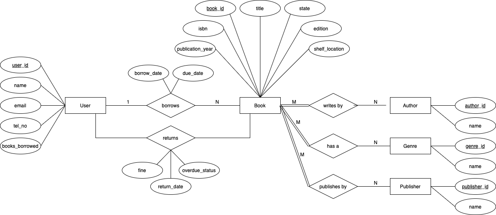

# Task 1 - Conceptual Modeling: Design an ER Diagram

## Potential improvements, features, and data requirements for managing the library efficiently

1. Enhancing User Data
    - Currently, the system tracks only the user's `name`.
    - `user_id`, `email`, `tel_no`, and `books_borrowed` for better identification, communication and tracking.
2. Improvement to Book Attributes
    - The book entity includes `book_id`, `state`, and `title`.
    - Additional details like `isbn`, `publication_year`, `edition`, or `shelf_location` can be included to help users to find the book easily.
3. Borrowing & Returns
    - The system tracks borrowing and return dates. 
    - However, the return date is assumed to be due date upon borrowing of book. The attribute `return_date` can be changed to `due_date`. When the user returns the book, the `return_date` can then be tracked.
    - To enforce penalties for overdue books, `fine` and `overdue_status` attributes are added. 

## Development of ER diagram and description

[Link](ER-diagram.drawio.pdf) to PDF file

This ER diagram models the relationships between Users, Books, Authors, Genres, and Publishers.
- Users can register their account and provide their name and contact details.
- Users can borrow and return books, with timestamps recorded.
- When the user returns the book, it is then checked for overdue status and if any fine occured.
- Books contain metadata information to help users to locate the book in the library.
- Books are linked to Authors, Genres, and Publishers for classification.
- Each book has a state to track its condition.
- A structured borrowing system helps manage book lending, returns, and potential overdue tracking.